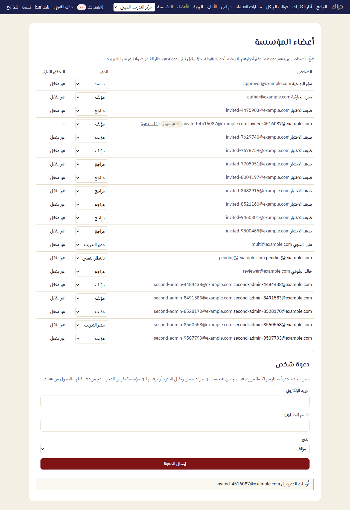
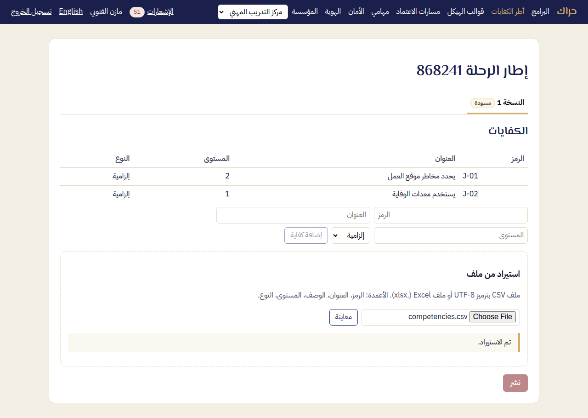
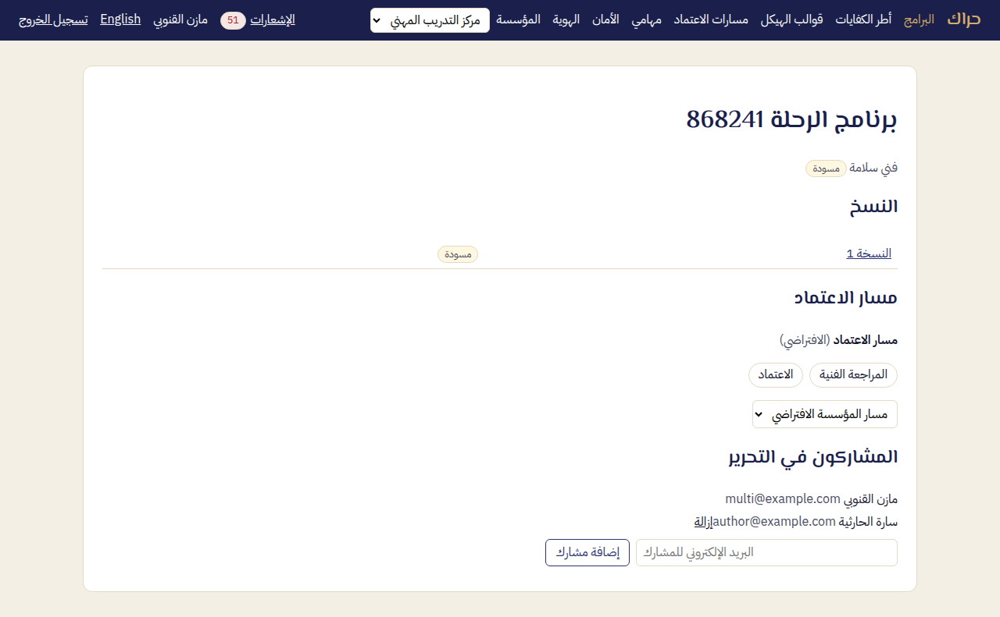

# دليل مدير التدريب — حراك

مدير التدريب يهيئ مساحة المؤسسة مرة واحدة: الأعضاء، والكفايات، وقوالب الهيكل، ومسار الاعتماد، والدخول. ثم يتابع البرامج. أسماء الأزرار في هذا الدليل كما تظهر في الواجهة العربية.

## 1. الدخول

1. افتح حراك، واكتب بريدك وكلمة مرورك، ثم **دخول**.
2. إن كانت مؤسستك تستخدم الدخول الموحد فاختر **الدخول عبر مؤسستك**.
3. إن كنت عضوًا في أكثر من مؤسسة فاختر المؤسسة من قائمة **المؤسسة** أعلى الصفحة.
4. نسيت كلمة المرور؟ اختر **نسيت كلمة المرور؟** في صفحة الدخول، وسيصلك رابط صالح ثلاثة أيام.

## 2. الأعضاء

من القائمة: **الأعضاء**.

- **إضافة شخص:** في **إضافة عضو** اكتب البريد والاسم واختر الدور، ثم **إضافة وإرسال الدعوة**.
  - من ليس له حساب تصله دعوة يختار منها كلمة مروره.
  - من له حساب يُبلَّغ بإضافته.
  - إن كانت المؤسسة تفرض الدخول الموحد يُطلب منه الدخول عبر مزوّدها.
- **تغيير الدور:** من القائمة بجانب الاسم. الأدوار: مدير التدريب، مؤلف، مراجع، معتمِد، بانتظار التعيين.
- **سحب الصلاحيات:** دور «بانتظار التعيين» يرفع كل صلاحيات الشخص دون حذفه.
- **حدود تغيير الدور:**
  - يبقى للمؤسسة مدير واحد على الأقل.
  - يبقى حساب الطوارئ مديرًا.
  - من يُسمّى لمرحلة في مسار الاعتماد يبقى بدور يقرر.
  - ستقول لك الصفحة ما تفعله أولًا.

## 3. أطر الكفايات

1. **أطر الكفايات**: اكتب اسم الإطار، ثم **إنشاء**.
2. **استيراد من ملف**: ملف CSV بترميز UTF-8 أو Excel، أعمدته الرمز والعنوان والوصف والمستوى والنوع.
3. **معاينة**: راجع ما سيُضاف وما سيُحدَّث وما فيه خطأ، ثم **تأكيد الاستيراد**.
4. **نشر**: الإطار المنشور مقفل. لتعديله أنشئ نسخة جديدة.

## 4. قوالب الهيكل

**قوالب الهيكل**: اسم القالب، ثم المستويات بالترتيب، حتى خمسة. لكل مستوى اسم بالعربية واسم بالإنجليزية، و**إضافة مستوى** لمستوى آخر. ثم **إنشاء** و**نشر**.

## 5. مسار الاعتماد

**مسارات الاعتماد**: لكل مرحلة:

- **اسم المرحلة**؛
- **المسؤول**: شخص بعينه، أو دور يستلم أحد حامليه المهمة؛
- **المهلة (أيام عمل)**؛
- ما يحدث **عند إعادة الإرسال**: تعود إلى المرحلة نفسها، أو تبدأ من الأولى.

المسار **الافتراضي** يتبعه كل برنامج لم يُختر له غيره. التذكير يصل قبل الموعد بيوم عمل وعند الموعد. ويُبلَّغ المدير بعد يومي عمل من التأخر.

## 6. البرامج

1. **البرامج**: العنوان، والدور المستهدف، و**قالب الهيكل**، و**إطار الكفايات**، و**الكفايات المستهدفة**، ثم **إنشاء**.
2. في صفحة البرنامج أضف المؤلفين: **البريد الإلكتروني للمشارك**، ثم **إضافة مشارك**.
3. بعد الاعتماد تُولَّد ملفات Word وPDF تلقائيًا. إن تعذّر التوليد يصلك إشعار، وفي صفحة النسخة زر **إعادة المحاولة**. الاعتماد لا يُلغى.

## 7. الأمان (الدخول الموحد والتحقق الثنائي)

**الأمان**:

- **قواعد الدخول:** التحقق الثنائي إلزامي للمديرين والمعتمِدين إن أردت، ومدة جلسة الدخول الموحد.
- **النطاقات الموثّقة:** أضف نطاق بريد المؤسسة، وانشر سجل TXT الذي تعرضه الصفحة، ثم تحقق.
- **مزوّد الهوية (OIDC):** المُصدِر ومعرّف العميل وسره. ثم **اختبار الاتصال** و**دخول تجريبي**.
- **التفعيل والفرض:**
  - **السماح بالدخول عبر المزوّد**.
  - ثم، بعد نجاح الاختبارين، **فرض الدخول الموحد**، ومعه **حساب الطوارئ**: مدير بكلمة مرور وتحقق ثنائي، لحين تعطل المزوّد.

حسابك أنت: اختر اسمك أعلى الصفحة (يظهر عليه «أمان حسابي» عند تمرير المؤشر)، فتُفتح صفحة **التحقق الثنائي** لتفعيله بتطبيق المصادقة. فعّله لنفسك قبل أن تفرضه على المديرين أو تصير حساب الطوارئ.

## 8. الهوية

**الهوية**: الشعار (PNG أو JPEG حتى 1 ميغابايت) واللون الأساسي. يظهران على غلاف ملفات Word وPDF المصدَّرة وفي عناوينها.
