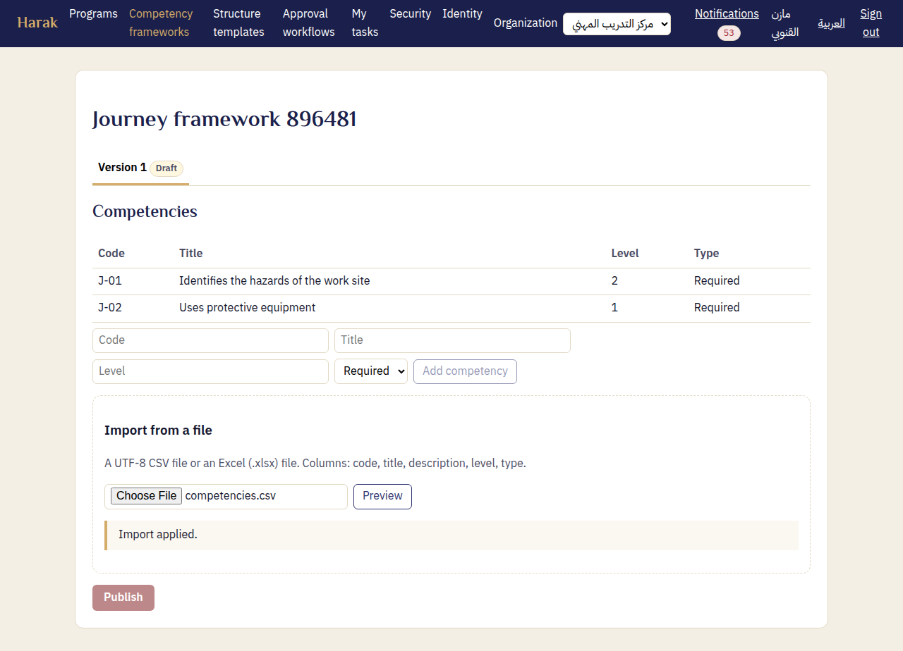
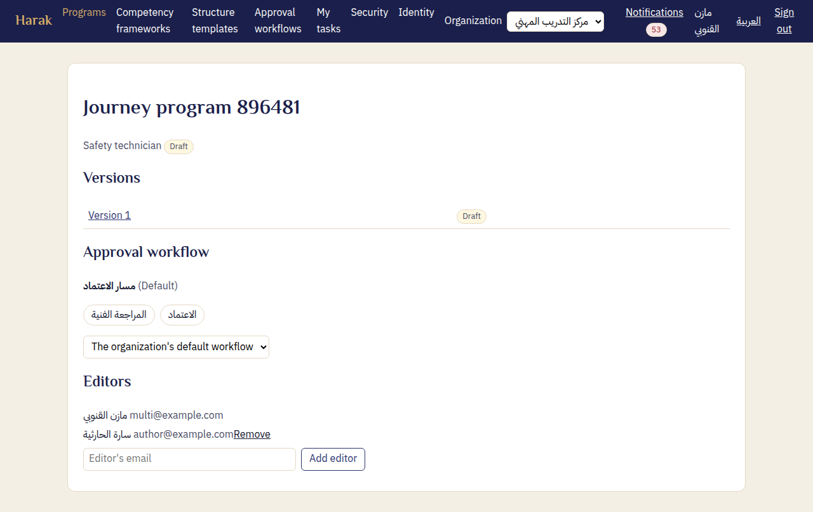

# Training manager's guide — Harak

The training manager sets up the organization's space once: members, competencies, structure templates, the approval workflow and sign-in. After that they follow the programs. Buttons are named as the English interface shows them.

## 1. Signing in

1. Open Harak, write your email and password, then **Sign in**.
2. If your organization uses single sign-on, choose **Sign in with your organization**.
3. If you belong to more than one organization, choose one from **Organization** at the top.
4. Forgot your password? Choose **Forgot your password?** on the sign-in page. A link valid for three days is sent to you.

## 2. Members

From the menu: **Members**.

- **Inviting someone:** under **Invite someone**, write their email and name and choose a role, then **Send the invitation**. No one joins without accepting (D90):
  - Someone without a password gets an invitation to choose one, and joins.
  - Someone with a Harak account signs in, then chooses **Accept** or **Decline**.
  - Where the organization enforces single sign-on, signing in through its provider accepts.
  - Until then their row says "Awaiting acceptance" with their email alone, and they do not work in the organization. You may **Cancel the invitation**, or change its role before it is accepted.
- **Changing a role:** use the list beside each name. The roles are training manager, author, reviewer, approver and pending assignment.
- **Taking away access:** "pending assignment" removes all of a person's permissions without removing them.
- **What a role change must keep:**
  - the organization has at least one manager;
  - the emergency account stays a manager;
  - a person a workflow stage names keeps a role that decides.
  - The page tells you what to do first.

## 3. Competency frameworks

1. **Competency frameworks**: write the framework's name, then **Create**.
2. **Import from a file**: a UTF-8 CSV or an Excel file with the columns code, title, description, level and type.
3. **Preview**: check what will be added, what updated and what has errors, then **Confirm import**.
4. **Publish**: a published framework is locked. To change it, create a new version.

## 4. Structure templates

**Structure templates**: the template's name, then its levels in order, up to five. Each level has an Arabic and an English name; **Add level** adds another. Then **Create** and **Publish**.

## 5. The approval workflow

**Approval workflows**: for each stage:

- **Stage name**;
- **Responsible**: one person, or a role one of whose holders takes the task;
- **Time allowed (work days)**;
- what happens **on resubmission**: it returns to this stage, or starts again from the first.

The **Default** workflow applies to every program that has no other. Reminders go out one work day before the due time and at it. The manager is told after two work days late.

**Whoever edits a program does not decide on it (D91):** they do not take a stage's task on it nor decide one, even holding the role. A program whose workflow names one of its editors by name for a stage cannot be submitted. So give every stage people who hold its role and do not edit programs.

## 6. Programs

1. **Programs**: the title, the target role, the **Structure template**, the **Competency framework** and the **Target competencies**, then **Create**.
2. On the program's page, add its authors: **Editor's email**, then **Add editor**.
3. Approval makes the Word and PDF files on its own. If they cannot be made you are told, and the version's page offers **Try again**. The approval stands either way.

## 7. Security (single sign-on and two-factor)

**Security**:

- **Sign-in rules:** require two-factor authentication of managers and approvers if you wish, and set the single sign-on session length.
- **Verified domains:** add the organization's email domain, publish the TXT record the page shows, then verify.
- **Identity provider (OIDC):** the issuer, client id and secret. Then **Test the connection** and **Test sign-in**.
- **Enabling and enforcing:**
  - **Allow signing in through the provider**.
  - Then, once both tests have passed, **Enforce single sign-on**, with an **Emergency account**: a manager with a password and two-factor, for when the provider is down.

Your own account: choose your name at the top of the page (it shows "My account security" on hover). It opens **Two-factor authentication**, where you turn it on with an authenticator app. Turn it on for yourself before requiring it of managers or becoming the emergency account.

## 8. Identity

**Identity**: the logo (PNG or JPEG up to 1 MB) and the primary color. They appear on the cover and headings of the exported Word and PDF files.
