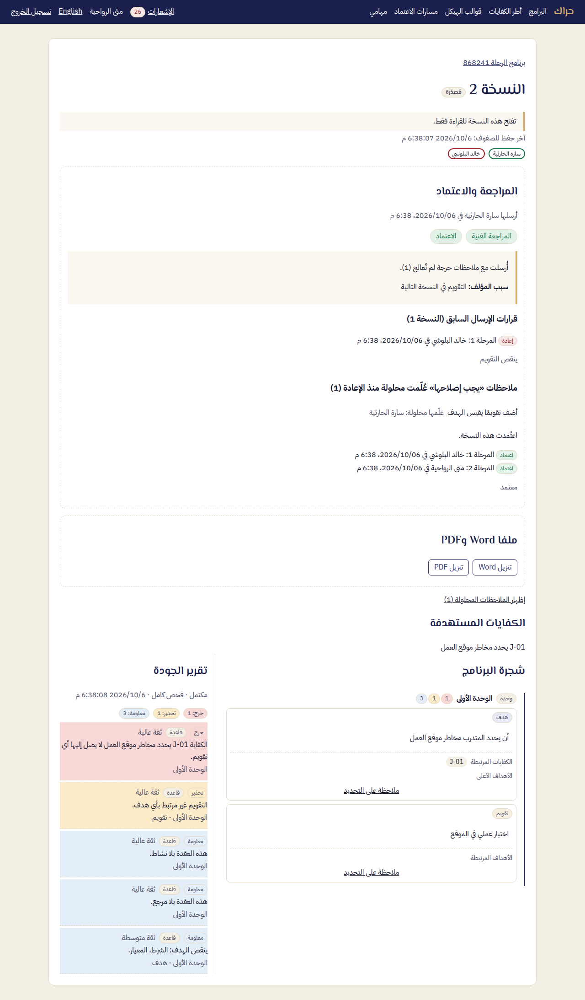

# دليل المعتمِد — حراك

المعتمِد صاحب القرار النهائي. يصله البرنامج بعد مراحل المراجعة، فيعتمده أو يعيده. الاعتماد يجمّد النسخة، ويولّد ملفي Word وPDF بهوية المؤسسة.

## 1. المهام

1. افتح **مهامي**. مرحلة الاعتماد تُوجَّه إليك باسمك أو إلى دور المعتمِدين.
2. في الحالة الثانية اختر **استلام المهمة** أولًا.
3. افتح المهمة.

إن كنت أُضفت محررًا لبرنامج قبل أن يتغير دورك، فلا تقرر فيه: من يحرر البرنامج لا يقرر فيه.

إن دعتك مؤسسة أخرى، تظهر دعوتها أعلى كل صفحة بعد دخولك: **قبول** أو **رفض**. لا تنضم إلى مؤسسة إلا بقبولك.

## 2. ما تراه

في **المراجعة والاعتماد**:

- قرارات المراحل السابقة وملاحظاتها.
- الملاحظات الحرجة إن وُجدت، و**سبب المؤلف**.
- تقرير الجودة بجانب المحتوى.

ملاحظاتك تكتبها كما يكتبها المراجع: **ملاحظة على التحديد**.

## 3. القرار

اكتب **ملاحظة القرار**، ثم اختر أحد الزرين:

- **اعتماد المرحلة:** في المرحلة الأخيرة تصير النسخة «معتمدة»، فلا يعدّلها أحد بعدها، ويُولَّد ملفا Word وPDF خلال لحظات. يُرفض الاعتماد ما دامت على البرنامج ملاحظة «يجب إصلاحه» مفتوحة: يعالجها المؤلف ويعلّمها محلولة، أو تعيد النسخة للتعديل.
- **إعادة للتعديل:** تتطلب ملاحظة القرار، وملاحظة مفتوحة واحدة على الأقل. تعود النسخة الجديدة بعد التعديل إلى المرحلة التي حددها مسار الاعتماد.

## 4. بعد الاعتماد

- في صفحة النسخة: **ملفا Word وPDF**، و**تنزيل Word** و**تنزيل PDF**.
- إن تعذّر توليدهما أُبلغ مدير التدريب، وأعاد المحاولة. الاعتماد قائم في كل حال.
- لتعديل برنامج معتمد تُنشأ **نسخة جديدة**، وتمر بالمسار من جديد.
