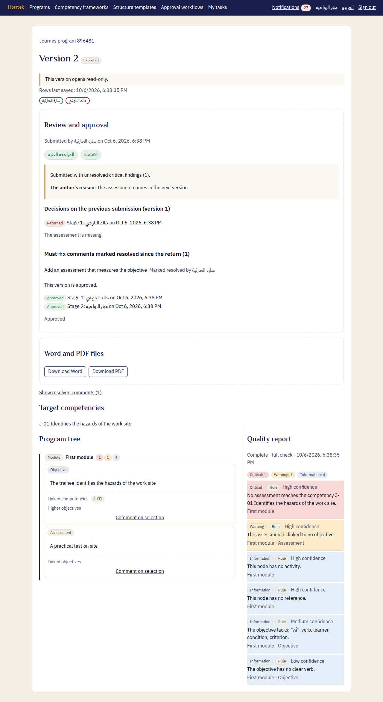

# Approver's guide — Harak

The approver takes the final decision. A program reaches them after the review stages, and they approve it or return it. Approval freezes the version and makes its Word and PDF files in the organization's identity.

## 1. Tasks

1. Open **My tasks**. The approval stage is addressed to you by name, or to the approvers' role.
2. In the second case, **Take the task** first.
3. Open the task.

## 2. What you see

Under **Review and approval**:

- The decisions and notes of the earlier stages.
- Any critical findings, with **The author's reason:**
- The quality report beside the content.

You comment as a reviewer does: **Comment on selection**.

## 3. The decision

Write a **Decision note**, then choose one of the two:

- **Approve the stage:** at the last stage the version becomes "Approved". No one can change it afterwards, and its Word and PDF files are made within moments.
- **Return for changes:** needs the decision note and at least one open comment. After the author's changes, the new version comes back to the stage the workflow sets.

## 4. After approval

- On the version's page: **Word and PDF files**, with **Download Word** and **Download PDF**.
- If they could not be made, the training manager is told and tries again. The approval stands either way.
- To change an approved program, a **New version** is made, and it goes through the workflow again.
