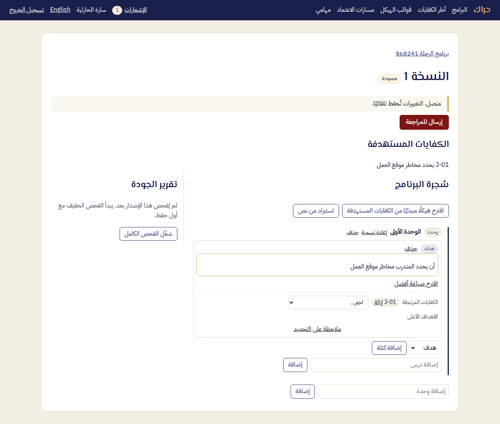
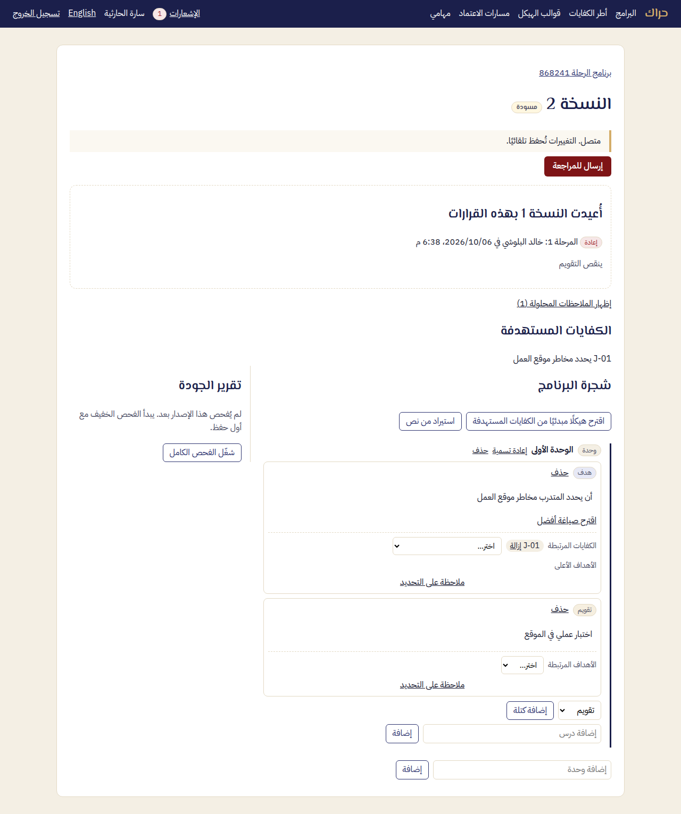
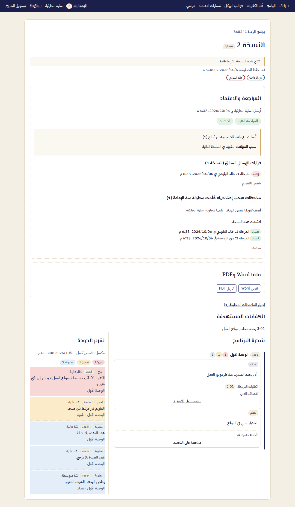

# دليل المؤلف — حراك

المؤلف يكتب محتوى البرنامج مع زملائه في الوقت نفسه، ويرى تقرير الجودة بجانبه، ثم يرسله للمراجعة. أسماء الأزرار كما تظهر في الواجهة العربية.

## 1. فتح المسودة

1. ادخل حراك ببريدك وكلمة مرورك، أو **الدخول عبر مؤسستك**.
2. افتح **البرامج**، ثم البرنامج، ثم **النسخة** المسودة.
3. أعلى الصفحة: «متصل. التغييرات تُحفظ تلقائيًا.» كل ما تكتبه يصل زملاءك فورًا ويُحفظ وحده.

## 2. الكتابة

- **الشجرة:** اكتب العنوان في خانة **إضافة <المستوى>**، مثل «إضافة وحدة»، ثم Enter. تحت كل عقدة تضيف مستواها التالي.
- **الكتل:** اختر **نوع الكتلة** (هدف، محتوى، نشاط، تقويم، مرجع)، ثم **إضافة كتلة**، ثم اكتب.
- **الكفايات:** تحت الهدف، في **الكفايات المرتبطة**، اختر الكفاية التي يخدمها الهدف.
- **اللصق من Word:** القوائم الملصوقة من Word تبقى قوائم.
- **منهج قائم:** **استيراد من نص**: ارفع ملف المنهج (PDF أو Word أو نص)، أو الصق نصه.
  - اختر **اقترح توزيع النص على الشجرة**.
  - راجع **التوزيع المقترح**، ثم **قبول** أو **رفض**.
  - لا يُضاف شيء قبل قبولك.
  - إن تعذّرت قراءة الملف ظهر السبب، والصق النص بدلًا منه.
- **الذكاء الاصطناعي** (إن فعّلته مؤسستك): **اقترح صياغة أفضل** لهدف ضعيف، و**اقترح هيكلًا مبدئيًا من الكفايات المستهدفة**. الاقتراح لا يغيّر شيئًا حتى تقبله.

## 3. تقرير الجودة

يظهر **تقرير الجودة** بجانب المحرر، ويتحدث وحده مع الكتابة. **شغّل الفحص الكامل** يعطي التقرير كاملًا. لكل ملاحظة سببها، ودرجتها (حرج، تحذير، معلومة)، ومكانها في الشجرة. ملاحظة لا تنطبق اختر لها **تجاهل** واكتب السبب، والمراجع يرى السبب.

## 4. الملاحظات

ظلّل نصًا ثم **ملاحظة على التحديد**. ما يكتبه المراجعون يظهر عند نصه. بعد المعالجة اختر **تعليم كمحلولة**.

## 5. الإرسال للمراجعة

1. **إرسال للمراجعة**. إن بقيت ملاحظات حرجة طُلب منك سببها، فاكتبه ثم **إرسال مع السبب**. يراه المراجع.
2. النسخة تُقفل للقراءة. يمكنك **سحب** الإرسال ما لم يُتخذ فيه قرار.

## 6. إذا أُعيدت النسخة

1. يصلك إشعار فيه ملاحظة المراجع، في **الإشعارات** وبالبريد.
2. افتح البرنامج: نسخة مسودة جديدة جاهزة، وفي أعلاها لماذا أُعيدت.
3. عالج الملاحظات، وعلّم «يجب إصلاحه» منها **كمحلولة**، ثم أرسل من جديد.

## 7. بعد الاعتماد

في صفحة النسخة المعتمدة: **ملفا Word وPDF**، ثم **تنزيل Word** و**تنزيل PDF**. يُولَّدان تلقائيًا خلال لحظات من الاعتماد.

