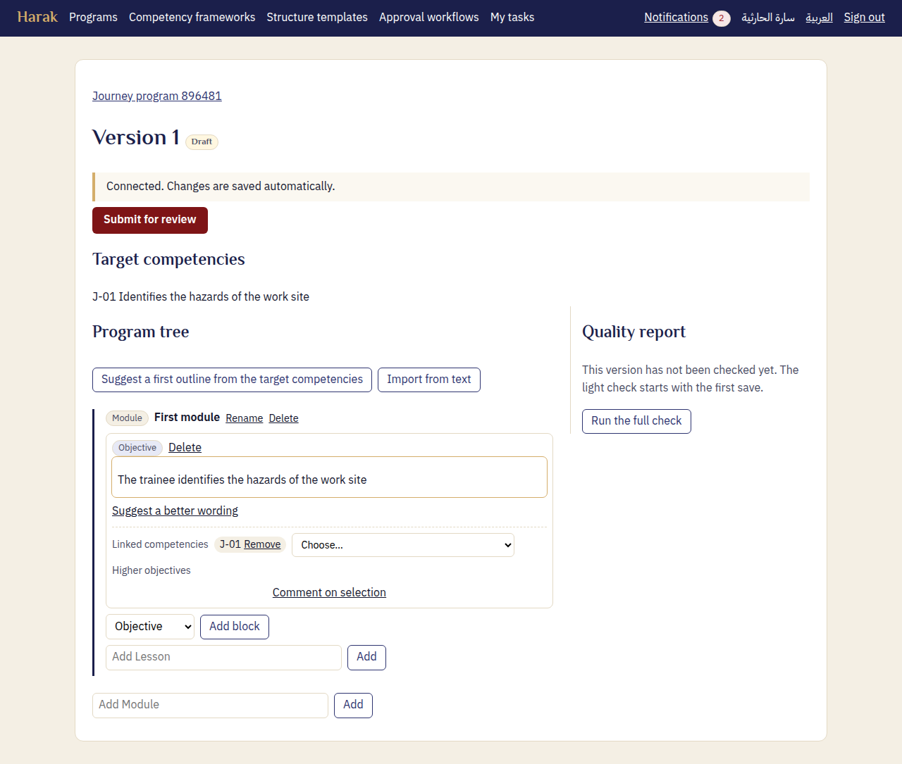
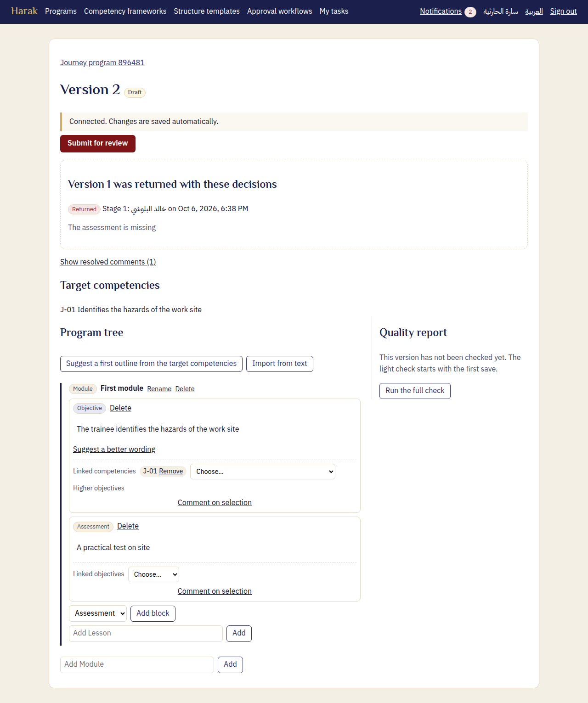
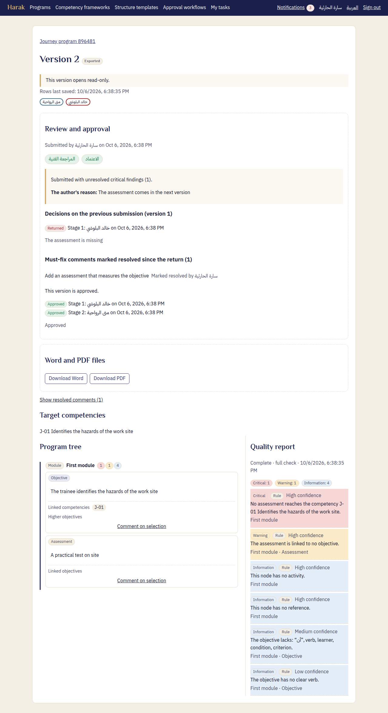

# Author's guide — Harak

Authors write a program's content together, at the same time, with its quality report beside them, then submit it for review. Buttons are named as the English interface shows them.

## 1. Opening the draft

1. Sign in with your email and password, or **Sign in with your organization**.
2. Open **Programs**, the program, then its draft **Version**.
3. At the top: "Connected. Changes are saved automatically." What you write reaches your colleagues at once and saves itself.

If another organization invites you, its invitation shows at the top of every page once you sign in: **Accept** or **Decline**. You join an organization only if you accept.

## 2. Writing

- **The tree:** write a title in **Add <level>**, such as "Add Module", then press Enter. Under each node you add its next level.
- **Blocks:** choose the **Block type** (Objective, Content, Activity, Assessment, Reference), then **Add block**, then write.
- **Competencies:** under an objective, in "Linked competencies", choose the competency it serves.
- **Pasting from Word:** lists pasted from Word stay lists.
- **An existing curriculum:** **Import from text**: upload the curriculum file (PDF, Word or text), or paste its text.
  - Choose **Suggest how to lay out the text**.
  - Check the **Suggested layout**, then **Accept** or **Reject**.
  - Nothing is added before you accept.
  - If the file cannot be read, the reason shows; paste the text instead.
- **AI** (if your organization uses it): **Suggest a better wording** for a weak objective, and **Suggest a first outline from the target competencies**. A suggestion changes nothing until you accept it.

## 3. The quality report

The **Quality report** sits beside the editor and updates as you write. **Run the full check** gives the whole report. Each finding says why, how serious it is (critical, warning, information) and where it is in the tree. For a finding that does not apply, choose **Dismiss** and give the reason; the reviewer sees it.

## 4. Comments

Select some text, then **Comment on selection**. Reviewers' comments show beside their text. Once handled, choose **Mark resolved**.

## 5. Submitting for review

1. **Submit for review**. If critical findings remain, you are asked why: write it, then **Submit with this reason**. The reviewer sees it.
2. The version locks, read-only. You may **Withdraw** it until a decision is taken on it.

## 6. If the version is returned

1. You are told, with the reviewer's note, in **Notifications** and by email.
2. Open the program: a new draft is ready, and its top says why it came back.
3. Handle the comments, **Mark resolved** the "Must fix" ones, and submit again.

## 7. After approval

On the approved version's page: **Word and PDF files**, then **Download Word** and **Download PDF**. They are made within moments of the approval.

