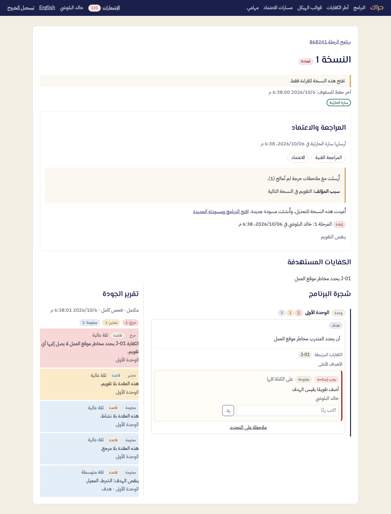

# دليل المراجع — حراك

المراجع يفحص المحتوى وتقرير جودته جنبًا إلى جنب، ويكتب ملاحظاته مثبتة على النص، ثم يقرر: يعتمد مرحلته، أو يعيد النسخة للتعديل.

## 1. المهام

1. افتح **مهامي**: كل نسخة تنتظر مرحلتك، بموعدها.
2. المهمة الموجهة إلى دور المراجعين: اختر **استلام المهمة** فتصير لك وحدك. لتركها لزميل اختر **إرجاع المهمة**.
3. افتح المهمة.

يصلك تذكير قبل الموعد بيوم عمل وعند الموعد. ويُبلَّغ المدير بعد يومي عمل من التأخر.

## 2. ما تراه

في **المراجعة والاعتماد**:

- من أرسلها ومتى، ومراحل المسار.
- إن أُرسلت مع ملاحظات حرجة: عددها، و**سبب المؤلف**.
- في الإرسال التالي لإعادة: قرارات الإرسال السابق، والملاحظات التي عُلّمت محلولة منذ الإعادة.

وبجانب المحتوى **تقرير الجودة**: مستوى بلوم لكل هدف، والمواءمة بين الكفايات والأهداف والتقويم، والاكتمال، ولكل ملاحظة سببها.

## 3. الملاحظات

ظلّل النص، ثم **ملاحظة على التحديد**. اختر **التصنيف**:

- **يجب إصلاحه:** يجب أن يعالجه المؤلف قبل الإرسال التالي.
- **اقتراح:** للمؤلف أن يأخذ به أو يتركه.

ثم **إضافة الملاحظة**. تبقى الملاحظة على نصها مهما عدّل المؤلف حوله.

## 4. القرار

اكتب **ملاحظة القرار**، ثم اختر أحد الزرين:

- **اعتماد المرحلة:** تنتقل النسخة إلى المرحلة التالية، أو تُعتمد إن كانت مرحلتك الأخيرة.
- **إعادة للتعديل:** تتطلب ملاحظة القرار، وملاحظة مفتوحة واحدة على الأقل على هذه النسخة. يُبلَّغ المؤلف، وتُنشأ له مسودة جديدة.

