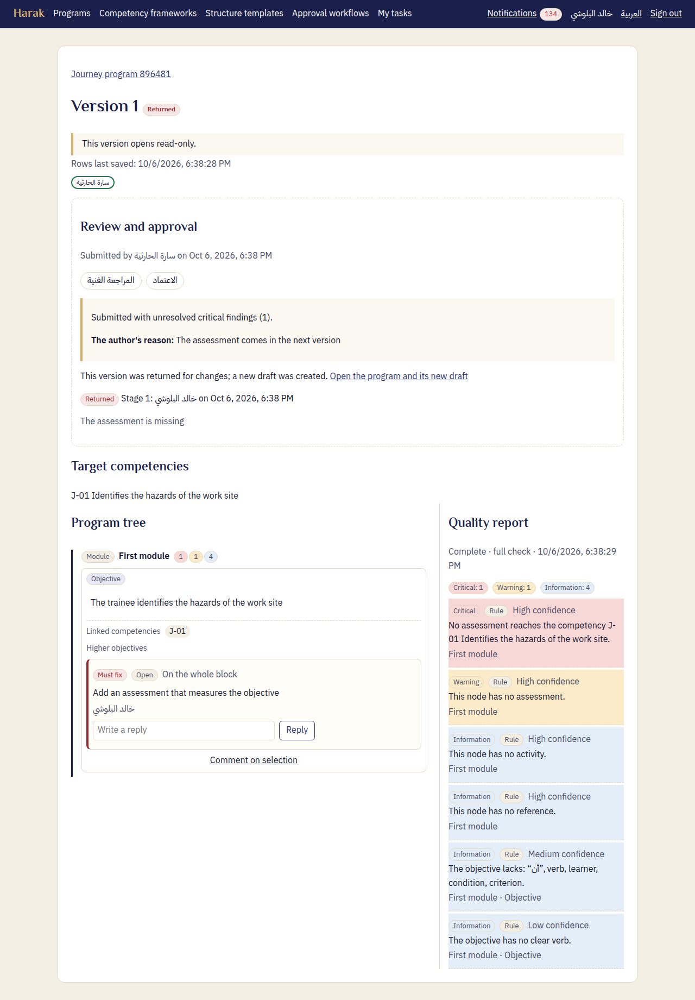

# Reviewer's guide — Harak

Reviewers read the content and its quality report side by side, leave comments anchored to the text, then decide: approve their stage, or return the version for changes.

## 1. Tasks

1. Open **My tasks**: every version waiting for your stage, with its due time.
2. For a task addressed to the reviewers' role, **Take the task** to make it yours alone. To leave it to a colleague, **Give the task back**.
3. Open the task.

A reminder comes one work day before the due time and at it. The manager is told after two work days late.

## 2. What you see

Under **Review and approval**:

- Who submitted it and when, and the workflow's stages.
- If it was submitted with critical findings: how many, with **The author's reason:**
- On a resubmission after a return: the previous submission's decisions, and the comments marked resolved since.

Beside the content, the **Quality report**: Bloom's level of each objective, how competencies, objectives and assessments align, completeness, and why each finding was made.

## 3. Comments

Select the text, then **Comment on selection**. Choose the **Category**:

- **Must fix:** the author must handle it before submitting again.
- **Suggestion:** the author may take it or leave it.

Then **Add comment**. The comment stays on its text however the author edits around it.

## 4. The decision

Write a **Decision note**, then choose one of the two:

- **Approve the stage:** the version moves to the next stage, or is approved if yours was the last.
- **Return for changes:** needs the decision note and at least one open comment on this version. The author is told and gets a new draft.

